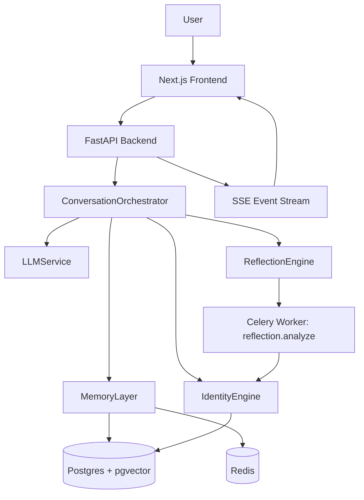

# Miryn AI: Main Product Architecture + Instructor Questions

## 1) Main Architecture of the Product

Miryn is a context-aware AI companion built as a full-stack system with three major domains:

- Experience layer (frontend)
- Intelligence layer (backend orchestration + LLM + reflection)
- Data/identity/memory layer (Postgres/pgvector + Redis + versioned identity)

### High-Level Component View

### Concrete Stack

- Frontend: Next.js 14 + TypeScript + Tailwind
- Backend: FastAPI
- Data: PostgreSQL + pgvector
- Cache + event queue transport: Redis
- Async jobs: Celery worker for reflection tasks
- Security/ops: auth endpoints, encryption fields for message content/metadata, rate limiting, audit logs, request IDs, Sentry hooks

## 2) End-to-End Runtime Flow (What Happens When User Sends a Message)

1. User sends message from frontend chat UI to `POST /chat/`.
2. Backend validates conversation ownership and creates conversation if needed.
3. `ConversationOrchestrator` loads latest identity snapshot via `IdentityEngine.get_identity()`.
4. `MemoryLayer.retrieve_context()` fetches hybrid memory context (semantic + recency + importance + transient cache).
5. User message is persisted via `MemoryLayer.store_conversation()`.
6. Conflict detection may run and publish `identity.conflict` events.
7. LLM generates assistant response using identity + retrieved context.
8. Assistant response is persisted via `MemoryLayer.store_conversation()`.
9. Reflection task is queued to Celery (`reflection.analyze`).
10. Worker analyzes entities/emotions/topics/patterns and writes identity updates (emotions, patterns, open loops).
11. Backend publishes SSE updates (`reflection.ready` / conflict events) to frontend.
12. Identity dashboard can show updated snapshot + evolution timeline.

## 3) Data Architecture

### 3.1 Memory Model (3-tier)

Miryn uses a practical, mixed memory model:

- Transient: short-lived Redis memory for immediate context.
- Episodic: medium-term Postgres memory (with retention/`delete_at`).
- Core: long-term durable memory in Postgres, used for semantic recall.

Tier decision supports explicit metadata override and heuristics:

- `memory_importance >= 0.8` -> core
- ephemeral/short low-memory_importance content -> transient
- otherwise -> episodic

Field definitions:

- `memory_importance`: float in the `0.0-1.0` range used for memory-tier decisions and hybrid retrieval weighting.
- `loop_priority`: ranked open-loop priority shown as `P1`, `P2`, etc. (or equivalent numeric ordering where `1` is highest priority).

Hybrid ranking uses weighted scoring:

- semantic score weight: 0.5
- recency score weight: 0.3
- memory importance score weight: 0.2

### 3.2 Identity Model (Versioned Snapshots)

Identity is not edited in place. Each update creates a new versioned snapshot in `identities` with `UNIQUE(user_id, version)`.

Identity is hydrated with related typed subdomains:

- beliefs
- open_loops
- patterns
- emotions
- conflicts

This gives an auditable timeline of identity evolution instead of a mutable profile blob.

### 3.3 Evolution Log

Field-level diffs are written to `identity_evolution_log` with:

- `field_changed`
- `old_value`
- `new_value`
- `trigger_type`
- timestamp

The UI can surface these changes through `GET /identity/evolution`.

## 4) What Is Different in Miryn (Key Differentiators)

### 4.1 Identity Layering

Most assistants only keep conversation history. Miryn maintains an explicit identity graph with structured layers:

- Beliefs (what user appears to hold true)
- Open loops (unfinished commitments/tensions)
- Patterns (behavioral/topic co-occurrence signals)
- Emotions (primary + secondary with intensity)
- Conflicts (detected contradictions)

### 4.2 Numbering/Scoring in Identity + Emotion

This is likely what instructors will ask about:

- Identity version numbering: every identity change increments `version`.
- Open-loop priority numbering: open loops carry `loop_priority` (shown in UI as `P1`, `P2`, etc.).
- Emotion intensity scoring: each emotion record has `intensity` on a 0-1 scale.
- Belief confidence scoring: each belief has `confidence` on a 0-1 style scale.
- Conflict severity scoring: each detected contradiction has `severity`.
- Memory weighting: identity includes `memory_weights` defaults (beliefs/emotions/facts/goals weights).

So Miryn is not only "chat + memory"; it is "chat + scored identity state machine" with versioned snapshots and explainable evolution.

### 4.3 Reflection as a Separate Cognitive Pass

Instead of only one-shot reply generation, Miryn runs a second reflective pipeline (background worker) that extracts:

- entities
- topics
- emotional tone
- temporal/topic patterns

and feeds those back into identity state.

### 4.4 SSE Event Feedback Loop

Frontend receives near-real-time updates (`reflection.ready`, `identity.conflict`) through server-sent events, making identity changes visible during/after interaction.

## 5) Potential Instructor Questions (and Strong Answers)

### Architecture & Design

1. Why versioned identity instead of direct updates?

Suggested answer:
Versioning gives auditability, rollback reasoning, and evolution visibility. We can explain exactly what changed and when, which is critical for trust and research-style evaluation.

2. Why keep both JSON fields and normalized sub-tables for identity domains?

Suggested answer:
The snapshot row is optimized for fast retrieval of current identity. Sub-tables provide structure and queryability for specific domains (beliefs, emotions, conflicts) and support cleaner analytics.

3. Why Redis if Postgres already stores messages?

Suggested answer:
Redis is used for low-latency transient memory and event streaming support. It reduces round-trip cost for immediate context and enables pub/sub-like user event delivery.

4. Why split reflection into a background worker?

Suggested answer:
To keep response latency low and still run deeper analysis. Reflection is computationally expensive and not required to block chat response.

5. How do you prevent prompt injection from user history during analysis?

Suggested answer:
Reflection prompts explicitly treat conversation payload as data. Also, identity updates are constrained by typed schemas and controlled update pathways.

### Identity Layer / Emotion Numbering

6. What exactly is "emotion numbering" here?

Suggested answer:
It is implemented as continuous intensity scores (0-1) per emotion entry, plus optional secondary emotions. We model intensity/probability-like confidence instead of hard category labels only.

7. How do you quantify open loops?

Suggested answer:
Each loop has a `loop_priority` value used for ranking and UI emphasis (P-level style priority). This is useful for coaching-like follow-ups.

8. How is contradiction/conflict represented?

Suggested answer:
Each conflict stores `statement`, `conflict_with`, and `severity`, making contradictions explicit and reviewable in identity state.

### Data, Security, and Reliability

9. How is sensitive message data protected?

Suggested answer:
Episodic/core memories can store encrypted content/metadata fields, with decrypt-on-read behavior. This allows defense-in-depth beyond transport security.

10. How do you avoid duplicate writes when retries happen?

Suggested answer:
Message persistence supports idempotency keys with conflict-safe insert behavior, preventing duplicate entries during retry/network failures.

11. How do you observe failures in production?

Suggested answer:
Structured request logging, request IDs, health endpoint checks (DB/Redis), and optional Sentry integration provide operational visibility.

12. What if reflection fails?

Suggested answer:
Chat still completes. Reflection is decoupled, so user interaction remains resilient. Failure only affects delayed insight enrichment, not core messaging.

## 6) Demo Script (Instructor-Friendly)

1. Show architecture diagram first (frontend -> backend -> orchestrator -> memory/identity/reflection).
2. Send one chat message and explain synchronous path.
3. Open identity dashboard and show current `version`, beliefs/loops/patterns/emotions.
4. Trigger another message with emotional or contradictory content.
5. Show conflict and reflection updates arriving via SSE.
6. Open evolution timeline and point out field-level change records.
7. Close with: Miryn tracks not only conversation, but identity evolution over time.

## 7) Honest Technical Notes (If Asked)

- Reflection accuracy depends on LLM quality and prompt discipline.
- Conflict quality depends on extracted beliefs and statement quality.
- Some evolution insights are probabilistic; they should be presented as assistive signals, not absolute truth.
- The strongest novelty is the combination of:
  - versioned identity
  - scored emotional/cognitive layers
  - hybrid memory retrieval
  - asynchronous reflection feedback loop

---

Prepared for project walkthrough and viva/instructor Q&A.
