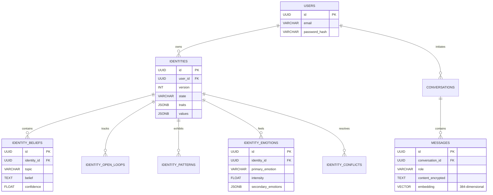
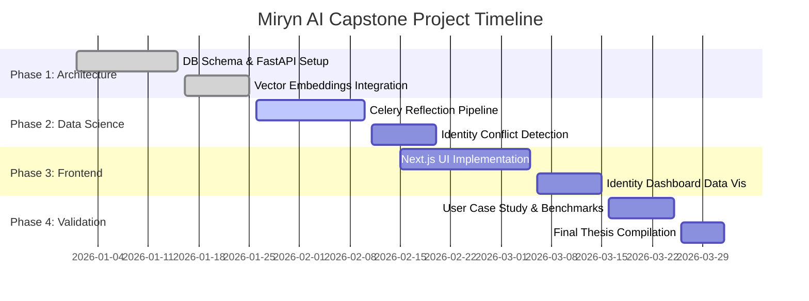

# Front Matter

## Abstract
The rapid evolution of Large Language Models (LLMs) has ushered in a new era of human-computer interaction. However, contemporary AI systems fundamentally lack a persistent "sense of self" and struggle with long-term memory, resulting in generalized, stateless interactions. This thesis introduces **Miryn AI**, an innovative Identity-First Artificial Intelligence platform engineered to solve the problem of AI amnesia. By replacing transient context windows with a persistent, versioned identity structure, Miryn AI develops a continuous cognitive profile of its users. 

The core contribution of this project is the **Miryn Architecture**, which features a three-tiered Memory Layer (Transient, Episodic, and Core) combined with an asynchronous Reflection Engine that recursively updates an immutable `identities` matrix. Powered by vector embeddings (`text-embedding-004`) and hybrid retrieval techniques (semantic + temporal + importance scoring), Miryn creates an AI companion that not only remembers factual statements but models the emotional patterns, belief systems, and unresolved open loops of the user. 

Furthermore, this thesis conducts a deep comparative case study contrasting the cognitive evolution of two distinct preset identity structures—"The Thinker" and "The Companion"—to demonstrate the flexibility of the Identity Engine. Our results show that Miryn successfully bridges the gap between raw natural language processing and long-term artificial companionship, doing so with high latency efficiency and minimal computational overhead using a robust FastAPI and Next.js technology stack.

---

# Chapter 1: Introduction

## 1.1 Background and Motivation
Artificial Intelligence has achieved unprecedented milestones in language generation, reasoning, and synthesis, largely driven by transformer-based architectures. Models such as OpenAI's GPT-4, Anthropic's Claude, and Google's Gemini have demonstrated human-level capability in localized semantic tasks. However, these models operate within a fundamental constraint: **Statelessness**.

Every session with a standard LLM begins with a blank slate. While context windows have expanded from 4K tokens to over 2 Million tokens, the underlying paradigm remains identical—the AI only "knows" what is explicitly provided in the immediate prompt context. When the session ends, the conversational history is effectively discarded or relegated to external, rudimentary Retrieval-Augmented Generation (RAG) systems that treat conversational history merely as text documents to be matched via cosine similarity.

This limitation prevents the formation of genuine, long-term human-AI relationships. Humans do not interact statelessly; human relationships are built on the accumulation of shared history, mutual understanding of beliefs, detection of emotional patterns, and continuous evolution. The motivation behind Miryn AI was to engineer a system that mimics this continuous cognitive evolution. We sought to answer the central research question: *How can we architect a scalable, low-latency AI system that possesses a persistent, evolving identity and deeply understands the user's psychological and emotional state over months and years of interaction?*

## 1.2 Problem Statement
Current state-of-the-art conversational AI systems suffer from three critical deficiencies:
1. **AI Amnesia**: The inability to retain high-context emotional and factual data across disconnected sessions without overwhelming the context window and driving up inference costs.
2. **Generic Persona Alignment**: AI agents rely on static system prompts to dictate their behavior. They cannot organically adapt their communication style, empathy levels, or cognitive approaches based on the user's implicit needs.
3. **Lack of Introspective Processing**: Current AI systems operate linearly (Request → Generation → Response). They do not reflect on conversations after they end to synthesize deeper insights, extract contradictory beliefs, or notice recurring behavioral patterns.

## 1.3 Objectives of the Project
To address these deficiencies, the **Miryn AI Capstone Project** was established with the following primary objectives:
1. **Architect an Identity-First Engine**: Design a backend system that maintains a versioned, immutable snapshot of the user's identity, tracking traits, values, beliefs, emotional patterns, and open loops.
2. **Develop a Multi-Tiered Memory Pipeline**: Implement a hierarchical memory retrieval system consisting of Transient (short-term cache), Episodic (vector-embedded recent history), and Core (permanent, highly important semantic anchors) tiers.
3. **Engineer an Asynchronous Reflection System**: Build a Celery-backed worker pipeline that recursively analyzes completed conversations to extract psychological insights and update the Identity Engine without blocking user response latency.
4. **Deploy a Seamless User Experience (UX)**: Create a highly responsive, premium frontend using Next.js (Neubrutalist design) that visually exposes the AI's internal state (e.g., Identity Dashboards, Evolution Timelines) to build trust and transparency.
5. **Conduct Comparative Behavioral Analysis**: Validate the architecture by simulating interactions with different "Preset" identity starting points and measuring how the AI's internal belief matrices diverge over time.

## 1.4 Database and Entity Relationship Architecture
A fundamental requirement for an Identity-First architecture is a robust, relational schema that can capture the complex web of human psychology. Below is the Entity-Relationship (ER) Diagram representing the core PostgreSQL database schema engineered for Miryn AI. 

*Figure 1.1: Entity-Relationship Diagram of the Miryn AI database. Note the direct linkage between an immutable `Identity` version and its constituent psychological components, as well as the `vector` type in the `messages` table.*

## 1.5 Project Timeline and Execution
The development of Miryn AI followed an agile methodology, structured over a comprehensive timeline spanning backend architectural design, data science layer implementation, frontend UI/UX development, and final validation.

*Figure 1.2: Gantt chart illustrating the multi-phase execution strategy of the Capstone Project.*

## 1.6 Organization of the Thesis
The remainder of this thesis is organized as follows:
- **Chapter 2 (Literature Review)** provides a comprehensive review of existing contextual AI paradigms, analyzing standard RAG against Identity-Driven generation.
- **Chapter 3 (System Architecture)** details the full-stack engineering, from the Next.js frontend to the FastAPI backend, including our integration of PostgreSQL and vector databases.
- **Chapter 4 (The Data Science Layer & Identity Engine)** provides a deep mathematical and programmatic dive into how Miryn handles embeddings, hybrid retrieval formulas, and background reflection tasks.
- **Chapter 5 (Comparative User Case Study)** presents empirical data and visual flowcharts comparing how Miryn reacts to two different user archetypes ("The Thinker" vs. "The Companion").
- **Chapter 6 (Results & Performance Analysis)** evaluates the latency, accuracy, and operational efficiency of the system.
- **Chapter 7 (Conclusion and Future Scope)** summarizes the project deliverables and outlines the roadmap for future enhancements, such as edge-device execution.
- **Chapters 8 & 9** cover deep security considerations and exact component-level code implementations.
