# Chapter 2: Literature Review and the State of Contextual AI

## 2.1 The Evolution of Conversational Agents
The trajectory of conversational artificial intelligence has been marked by three distinct eras. The first era consisted of rule-based dialogue systems (e.g., ELIZA, ALICE), which relied on hard-coded decision trees and regex pattern matching. The second era introduced intent-based Natural Language Understanding (NLU) systems (e.g., Dialogflow, Rasa) which utilized machine learning to classify user intents and map them to predefined responses. 

The current, third era is dominated by Large Language Models (LLMs) such as the Generative Pre-trained Transformer (GPT) series. These models generate responses autoregressively by predicting the next token in a sequence based on vast pre-training datasets. While their fluency and semantic understanding are revolutionary, they inherently operate statelessly; the model possesses no internal mutable memory mechanism across separate generation tasks.

## 2.2 The Problem of Statelessness in LLMs
Statelessness in deep learning language models means that the $i$-th prompt sent to the API is entirely independent of the $(i-1)$-th prompt, from the model's perspective. To create the illusion of a continuous conversation, developers must prepend the entire conversational history to every new user prompt. 

This approach introduces significant limitations:
1. **The Context Window Boundary**: Every model has a hard token limit (e.g., 8K, 128K, or 1M tokens). Once a conversation exceeds this limit, history must be truncated or summarized, leading to catastrophic forgetting.
2. **Attention Dilution**: Even within a massive context window (e.g., Gemini 1.5 Pro's 2M context window), the self-attention mechanism, $Attention(Q, K, V) = softmax(\frac{QK^T}{\sqrt{d_k}})V$, can suffer from "lost in the middle" phenomena. As the context length $L$ grows, the model struggles to retrieve specific, highly relevant facts buried in the middle of a massive block of text.
3. **Inference Latency and Cost**: Compute cost scales quadratically (or optimally linearly in newer sparse attention models) with context length. Passing 100,000 tokens of history on every single chat message is economically and computationally unviable for a consumer application.

## 2.3 Retrieval-Augmented Generation (RAG): Strengths and Limitations
To mitigate context limitations, the industry standard has shifted toward **Retrieval-Augmented Generation (RAG)**. In a traditional RAG pipeline, external documents (or past conversation turns) are chunked, embedded into dense vectors using models like `text-embedding-ada-002` or `text-embedding-004`, and stored in a vector database (e.g., Pinecone, pgvector). When a user asks a question, the query is embedded, and a K-Nearest Neighbors (K-NN) or Approximate Nearest Neighbor (ANN) search retrieves the $top\text{-}k$ most semantically similar chunks. These chunks are appended to the context window.

**Limitations of Traditional RAG in Conversational AI:**
Standard RAG is highly effective for document retrieval. However, it is fundamentally flawed for human-like conversational memory:
- **Over-reliance on Semantic Similarity**: If a user says "I am feeling sad today," a standard RAG system will retrieve past instances where the user said "sad." It will *fail* to retrieve the context of why they might be sad (e.g., a breakup mentioned 3 weeks ago but described using different semantics like "We ended things").
- **Lack of Synthesized Knowledge**: Traditional RAG retrieves raw conversation logs. It does not synthesize these logs into a coherent psychological profile.
- **Inability to Track Open Loops**: Standard RAG cannot inherently track promises or unresolved topics across time.

## 2.4 The Shift to Identity-First and Agentic Architectures
Recognizing the flaws in standard RAG, the research frontier has moved toward Agentic AI and Memory-Augmented Neural Networks. Projects like Stanford's "Generative Agents" demonstrated that LLM agents could simulate believable human behavior by utilizing a Memory Stream and a Reflection mechanism to synthesize higher-level inferences.

**Miryn AI** builds directly upon this paradigm. Rather than merely retrieving raw past statements, Miryn AI introduces the **Identity-First Architecture**. 

### 2.4.1 Standard RAG vs. Identity-First Architecture

The structural differences between Standard RAG and Miryn's Identity-First approach can be visualized in the following system flow diagram:

```mermaid
graph TD
    subgraph "Standard RAG Architecture"
        R_User[User Query] --> R_Embed[Generate Query Embedding]
        R_Embed --> R_VectorDB[(Vector DB of Raw Transcripts)]
        R_VectorDB -- Top K Similar Logs --> R_Prompt[Construct Prompt]
        R_Prompt --> R_LLM[LLM API]
        R_LLM --> R_Reply[Stateless Reply]
    end

    subgraph "Miryn Identity-First Architecture"
        I_User[User Query] --> I_Orchestrator[Orchestrator]
        I_Orchestrator --> I_Memory[Hybrid Memory Retrieval]
        I_Orchestrator --> I_Identity[Fetch Identity Version Matrix]
        
        I_Memory -- Temporal + Semantic Context --> I_Context[Synthesize Context]
        I_Identity -- Traits, Beliefs, Emotional State --> I_Context
        
        I_Context --> I_LLM[LLM API]
        I_LLM --> I_Reply[Highly Personalized Reply]
        
        I_Reply -. Async Trigger .-> Celery[Celery Reflection Engine]
        Celery -. Updates .-> I_Identity
    end
```

*Figure 2.1: A comparative flowchart demonstrating how Miryn's Identity-First architecture feeds dynamic psychological data into the LLM context, and recursively updates itself asynchronously, unlike the linear pipeline of standard RAG.*

This thesis posits that by separating the "Memory Retrieval" layer from the "Identity Synthesis" layer, an AI can achieve a level of conversational persistence and personalization that dramatically outperforms both massive context-window LLMs and standard RAG implementations.
