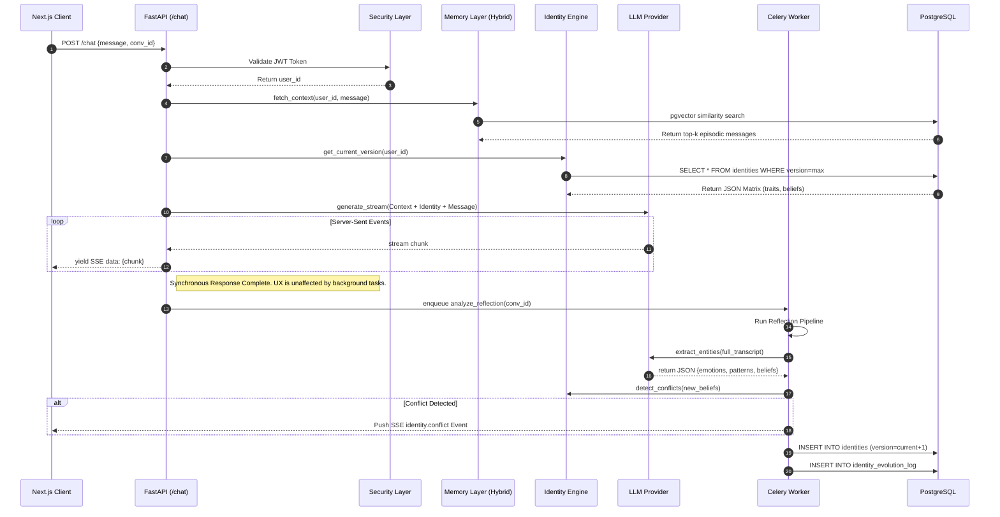

# Chapter 3: System Architecture and Pipeline Design

## 3.1 High-Level Architecture Overview
The Miryn AI platform is designed as a decoupled, microservices-oriented architecture to ensure low-latency chat interactions while handling computationally expensive embedding generation and identity synthesis in the background. The system is divided into three primary layers:
1. **The Client Presentation Layer**: A highly responsive, Server-Side Rendered (SSR) web application built using Next.js 14 App Router.
2. **The API Orchestration Layer**: A high-performance Python backend powered by FastAPI, responsible for synchronous chat handling, routing, and access control.
3. **The Asynchronous Reflection Layer**: A Celery-based worker queue backed by Redis, dedicated to deep processing, entity extraction, and database mutation without blocking the main event loop.

## 3.2 Detailed System Interaction (Sequence Diagram)
To fully understand the latency optimization of Miryn AI, we must trace the exact execution path of a user's message. The sequence diagram below illustrates the exact API calls, database fetches, and background job delegation that occur when a chat request is initiated.

*Figure 3.1: Sequence Diagram detailing the synchronous fast-path for user response and the asynchronous slow-path for Identity Mutation.*

## 3.3 Technology Stack Justification
- **Frontend (Next.js 14 & TailwindCSS)**: Chosen for its robust App Router architecture, allowing for server-side state hydration and native Server-Sent Events (SSE) handling, which is crucial for real-time streaming of LLM tokens and asynchronous notifications (e.g., when the Reflection Engine detects an identity conflict). The UI follows a strict "Neubrutalist" design system using deep void backgrounds (`bg-void`) and highly legible typographic tracking to create a premium "quiet room" aesthetic.
- **Backend (FastAPI & Python 3.11+)**: Python is the lingua franca of AI/ML development, providing native support for LLM SDKs. FastAPI was selected over Django or Flask due to its native asynchronous support (`asyncio`), which is mandatory for I/O-bound LLM API calls and high-throughput concurrent WebSocket/SSE connections.
- **Database (PostgreSQL & `pgvector`)**: Instead of relying on a disparate tech stack of a relational database and a standalone vector database, we utilized PostgreSQL with the `pgvector` extension. This allows for ACID-compliant transactions combining standard relational queries with semantic vector searches (`ORDER BY embedding <-> query_embedding`) in a single query execution plan.

## 3.4 The Three-Tier Memory Pipeline
A core innovation of the Miryn Architecture is the 3-Tier Memory Pipeline, designed to balance temporal relevance, semantic importance, and context-window optimization.

1. **Transient Tier (Working Memory)**: Ephemeral (2-hour TTL cache in Redis). Stores the verbatim transcript of the current session. Not embedded immediately to save compute.
2. **Episodic Tier (Recent History)**: Medium-term storage in PostgreSQL (`messages` table). Every message is eventually passed through an embedding model (e.g., `text-embedding-004` resulting in a 384-dimensional vector).
3. **Core Tier (Semantic Anchors)**: Permanent storage in `identity_beliefs`. Synthesized facts extracted by the Reflection Engine that have been assigned a high Importance Score ($I \geq 0.8$). 

### 3.4.1 Hybrid Retrieval Algorithm
When the `MemoryLayer.retrieve_context()` function is invoked, it computes a Hybrid Relevance Score ($S_{hybrid}$) for past episodic messages based on:
1. **Semantic Similarity ($S_{sem}$)**: Cosine similarity between embeddings $\mathbf{q}$ and $\mathbf{v}$.
2. **Temporal Decay ($S_{temp}$)**: An exponential decay function based on the time elapsed $\Delta t$.
3. **Importance Weight ($S_{imp}$)**: A predefined heuristic evaluating emotional intensity.

$$ S_{hybrid} = \alpha S_{sem} + \beta S_{temp} + \gamma S_{imp} $$

## 3.5 Data Security and Privacy Vault
- All stored episodic memory content (`content_encrypted` column) is encrypted at rest using AES-256-GCM. 
- The system utilizes a master `ENCRYPTION_KEY` injected via environment variables. When the hybrid retrieval algorithm fetches a row, decryption occurs dynamically in application memory prior to being passed to the LLM context.
