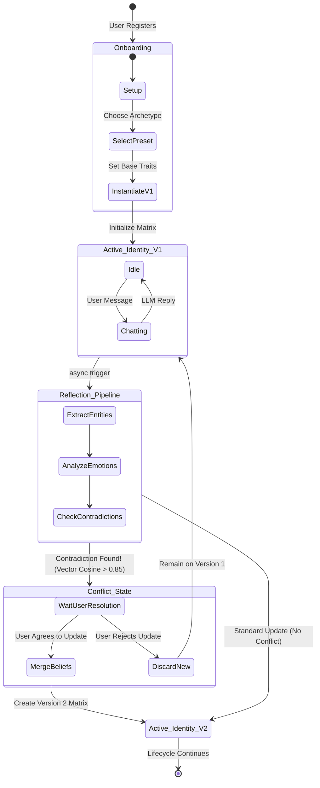

# Chapter 4: The Identity-First Engine & Data Science Layer

## 4.1 Introduction to the Identity Matrix
At the core of Miryn AI is the **Identity Engine**. Unlike traditional systems that treat a user as a `user_id` string attached to a blob of unstructured text, Miryn treats the user as an evolving multidimensional matrix. 

When a user completes the frontend Next.js onboarding wizard (which features dynamic preset selection and psychological alignment scoring), the system instantiates their `Version 1` Identity. The identity schema is highly structured and distributed across multiple relational tables in PostgreSQL, allowing the AI to query specific cognitive attributes with millisecond latency.

### 4.1.1 The Five Pillars of Identity
The Identity Engine maintains five distinct tables to map human psychology:
1. **Traits & Values (`identities` table)**: Quantitative float values (0.0 to 1.0) defining baseline personality. For instance, `openness: 0.8`, `reflectiveness: 0.7`, `honesty: 0.85`.
2. **Beliefs (`identity_beliefs`)**: Explicit statements the user holds to be true (e.g., "Hard work outweighs innate talent"), paired with a `confidence` metric that fluctuates based on reinforcement in future conversations.
3. **Open Loops (`identity_open_loops`)**: Unresolved topics or ongoing narratives. If a user states, "I have an interview next Tuesday," the DS layer classifies this as an open loop with high importance. The AI will proactively ask about it in subsequent interactions.
4. **Emotional Patterns (`identity_emotions`)**: A tracking system for emotional baselines, extracting primary emotions (e.g., "anxious", "elated") and calculating intensity over time to map emotional volatility.
5. **Conflicts (`identity_conflicts`)**: A unique feature of Miryn. If a user states a belief that mathematically contradicts a previously recorded belief, the system flags a "conflict."

## 4.2 State Diagram: Identity Versioning Lifecycle
To maintain data integrity and allow for historical rollback, Miryn treats identity as an immutable ledger. Every time the Reflection Engine extracts a new belief or modifies a trait, it creates a new row in the `identities` table with `version = current_version + 1`. 

The following State Diagram illustrates the lifecycle of a user's Identity Matrix, from Onboarding to active Conflict Resolution.


*Figure 4.1: State Diagram illustrating the immutable versioning system of the Identity Matrix. Note how conflicts force a sub-state requiring active user resolution before a new identity version can be minted.*

## 4.3 The Asynchronous Reflection Pipeline
A critical data science challenge in conversational AI is extracting structured intelligence from unstructured dialogue *without* introducing unacceptable latency for the user. If the AI attempted to analyze the user's emotional state, update traits, and search for contradictions before replying, the Time-to-First-Token (TTFT) would exceed 5-10 seconds.

To solve this, Miryn AI implements an **Asynchronous Reflection Pipeline** utilizing Celery Workers and a Redis message broker.

### 4.3.1 Entity and Pattern Extraction
The Reflection Engine's primary DS task is multi-label classification and entity extraction. The worker prompts the extraction LLM to return a strict JSON schema containing:
```json
{
  "entities": ["..."],
  "emotions": {"primary_emotion": "anxious", "intensity": 0.7},
  "topics": ["career transition", "interview preparation"],
  "patterns": {
      "topic_co_occurrences": [{"pattern": "Discusses career transition when feeling anxious", "frequency": 3}]
  },
  "insights": "User is displaying high stress regarding upcoming milestone."
}
```
Once this JSON is parsed, the backend script mathematically updates the Identity Matrix. 

## 4.4 Contradiction Detection via Vector Math
The most advanced feature of the DS layer is **Conflict Detection**. When the user states a new belief, the system embeds it into a 384-dimensional vector ($\mathbf{v}_{new}$). It then performs a cosine similarity search against all stored beliefs in `identity_beliefs` ($\mathbf{v}_{stored}$).

If a high similarity is found (e.g., $Cosine(\mathbf{v}_{new}, \mathbf{v}_{stored}) > 0.85$), the system analyzes the semantic polarity. If the polarity is inverted (e.g., "I love working from home" vs "Remote work is destroying my productivity"), the system generates a Conflict Object.

```python
def detect_conflicts(new_statement_embedding, identity_id):
    similar_beliefs = vector_db.query(
        embedding=new_statement_embedding, 
        filter={"identity_id": identity_id}, 
        top_k=5, 
        threshold=0.85
    )
    for belief in similar_beliefs:
        polarity_score = llm_analyze_polarity(new_statement, belief.text)
        if polarity_score == "CONTRADICTION":
            write_conflict_to_db(new_statement, belief.text, severity=0.9)
```

These conflicts are streamed live to the Next.js frontend via SSE (`identity.conflict` event), allowing the UI to render an interactive "Insights Panel" where the user can actively resolve the psychological contradiction.
