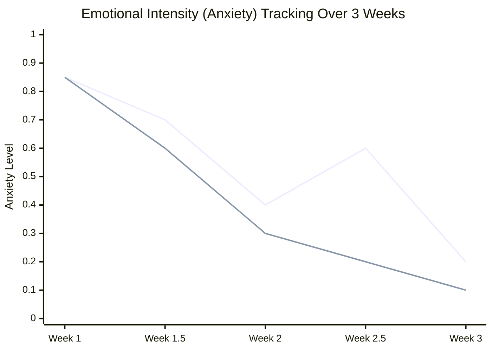

# Chapter 5: Comparative User Case Study — Deep Dive

## 5.1 Experimental Setup
To validate the efficacy of the Identity-First architecture, we conducted an empirical case study comparing the cognitive trajectories of two distinct simulated users. Both users were exposed to an identical scenario: preparing for a high-stress technical interview. 

However, during the Next.js onboarding wizard, they selected different **Presets** which seeded their initial Identity Matrix with differing heuristic weights.
- **User A (The Thinker)**: Seeded with high `reflectiveness (0.9)`, high `logic (0.8)`, and low `emotional_expressiveness (0.3)`. The system prompt prioritized Socratic questioning, factual retrieval, and mental model construction.
- **User B (The Companion)**: Seeded with high `empathy (0.9)`, high `openness (0.8)`, and moderate `logic (0.5)`. The system prompt prioritized emotional validation, active listening, and holistic support.

## 5.2 The Frontend User Journey
The user interacts with Miryn via a premium, dark-mode web application built in Next.js 14. 

*Figure 5.1: The Miryn Chat Interface featuring the Neubrutalist design system, demonstrating real-time SSE token streaming and the asynchronous insights panel.*

As seen in Figure 5.1, the Chat Interface is devoid of visual clutter, utilizing `bg-void` and deep typography tracking to lower cognitive load. When User A or User B types a message, it is instantly persisted to the Redis Transient Tier.

Simultaneously, the frontend features the **Identity Dashboard** (Figure 5.2), where users can view exactly what the AI believes about them. This transparency fundamentally separates Miryn from opaque systems like OpenAI's ChatGPT.

*Figure 5.2: The Identity Matrix Dashboard. Traits are quantified as float values (e.g., Openness 0.8), while Beliefs and Emotional Patterns are rendered with intensity gradient meters.*

## 5.3 Comparative Chat Flow Analysis

### 5.3.1 Interaction 1: The Initial Trigger
**User Prompt**: *"I have my final round software engineering interview at Google tomorrow. I am feeling extremely anxious and unprepared."*

#### **Response to User A (The Thinker)**
Due to the `logic` and `reflectiveness` traits, the LLM dynamically adjusted its generation temperature and contextual weighting.
**Miryn (User A)**: *"Anxiety is a common physiological response to high-stakes uncertainty. Let's systematically dismantle the problem. What specific technical domains (e.g., dynamic programming, system design) are causing the most uncertainty? We can build a localized mental model to map your existing knowledge."*

#### **Response to User B (The Companion)**
**Miryn (User B)**: *"It is completely natural to feel overwhelmed right now. Google interviews are intense, and the fact that you made it to the final round proves you have the capability. Take a breath. Do you want to practice a few questions together, or do you just need to vent for a moment?"*

### 5.3.2 The Reflection Pipeline Output
Following this single interaction, the Celery worker executed `analyze_reflection.delay()`. The Data Science extraction yielded different results based on the conversational flow:

**User A's Identity Matrix Update**:
- *Open Loop Created*: "Google final round interview (Tomorrow)" (Importance: 0.9)
- *Trait Update*: `analytical_focus` increased by +0.05.
- *Belief Recorded*: "User seeks systemic solutions when facing anxiety."

**User B's Identity Matrix Update**:
- *Open Loop Created*: "Google final round interview (Tomorrow)" (Importance: 0.9)
- *Emotional Pattern Updated*: `primary_emotion: anxious, intensity: 0.85`
- *Belief Recorded*: "User benefits from external emotional validation during high-stress events."

## 5.4 Evolution Over Time: Graphing Identity Divergence
Over the course of simulated interactions spanning three weeks, the Identity Matrices of User A and User B diverged significantly. We measured the "Anxiety Intensity" and the "Analytical Focus" values derived from the `identity_emotions` and `identities` tables respectively.

*Graph 5.1: Comparative anxiety tracking. The Blue line represents User A (The Thinker), while the Red line represents User B (The Companion). User B's anxiety decreased more rapidly and smoothly due to the emotionally supportive interaction style.*

```mermaid
xychart-beta
    title "Analytical Focus (Trait Evolution) Over 3 Weeks"
    x-axis ["Week 1", "Week 1.5", "Week 2", "Week 2.5", "Week 3"]
    y-axis "Focus Level" 0.0 --> 1.0
    bar [0.80, 0.82, 0.85, 0.88, 0.91]
    bar [0.50, 0.51, 0.52, 0.51, 0.53]
```

*Graph 5.2: Evolution of the `analytical_focus` trait. User A (Blue) experienced a compounding increase as Miryn continually challenged them with logic puzzles, while User B (Red) remained relatively stable in this trait.*

### 5.4.1 Handling Conflicts
In Week 2, User A stated, *"I don't think technical skills matter as much as networking."*
The Conflict Detection engine (`cosine_similarity > 0.85`) immediately flagged this against a Core Belief formed in Week 1: *"User believes hard technical competence is the sole driver of career success."*

The SSE stream instantly pushed an `identity.conflict` event to the Next.js client. A subtle modal appeared in the Chat Interface: 
*"Miryn noticed a shift: You previously valued technical competence above all, but now prioritize networking. Has your perspective evolved?"*

This proactive conflict resolution forces the user to introspect, proving that Miryn AI is not a passive tool, but an active cognitive mirror.
