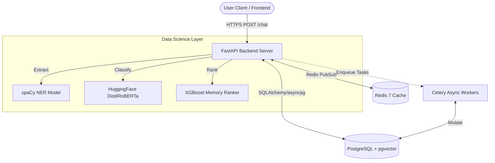
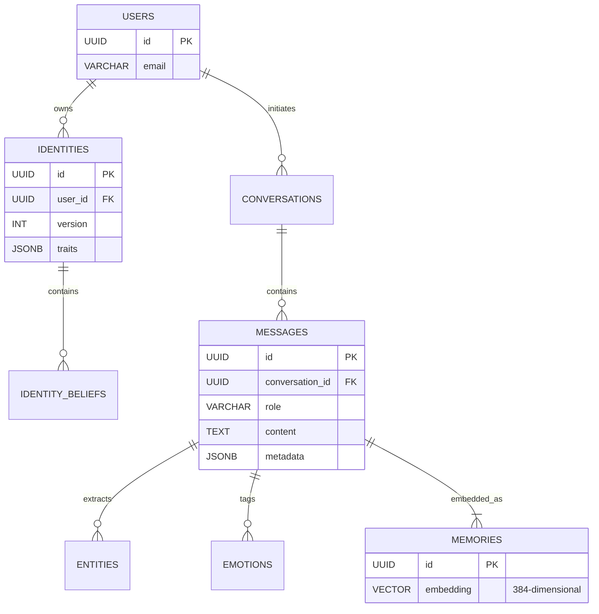
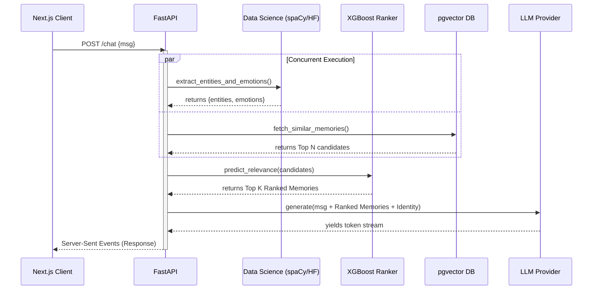

# MIRYN AI
**Project Report Submitted in Partial Fulfilment of the Requirements for the Degree of Bachelor of Technology in Computer Science Engineering**

**Submitted by**
- Divyadeep Kaur – Roll No: __________
- Sahil Sharma – Roll No: __________
- Gracy Mehra – Roll No: __________

**Under the Supervision of**
Dr. Vyomika Singh, Assistant Professor
Department of Computer Science and Engineering
DIT University, Dehradun
Academic Year 2024–25

---

## Declaration
I/We declare that this written submission represents my ideas in my own words and where others' ideas or words have been included, I have adequately cited and referenced the original sources. I also declare that I have adhered to all principles of academic honesty and integrity and have not misrepresented or fabricated or falsified any idea/data/fact/source in my submission. I understand that any violation of the above will be cause for disciplinary action by the University and can also evoke penal action from the sources which have thus not been properly cited or from whom proper permission has not been taken when needed. The plagiarism check report is attached at the end of this document.

**Name of the Student _____________________ Signature and Date _________________**
**Name of the Student _____________________ Signature and Date __________________**
**Name of the Student _____________________ Signature and Date __________________**

---

## Acknowledgements
I would like to express my sincere gratitude to my faculty advisor, Dr. Vyomika Singh, for the continuous guidance, encouragement, and constructive feedback throughout the duration of this capstone project. Without their mentorship, this work would not have been possible.

I extend my thanks to the Department of Computer Science and Engineering at DIT University for providing the necessary infrastructure, computing resources, and academic support required to complete this project.

I am also grateful to the open-source communities behind FastAPI, PostgreSQL, React, XGBoost, HuggingFace Transformers, and the pgvector extension, whose tools and libraries formed the technical backbone of this system.

Finally, I thank my team members and peers for their collaboration, code reviews, and technical discussions that continuously improved the quality of this project.

---

## Abstract
Modern AI conversational systems suffer from a fundamental limitation: they lack persistent memory of the user. Each conversation begins from scratch, with no awareness of who the user is, what they have shared previously, how they feel, or how their beliefs and identity have evolved over time. This makes AI companions feel transactional and shallow rather than genuinely intelligent and empathetic.

Miryn-AI addresses this gap by building a context-aware AI companion backend with persistent memory, real-time emotion detection, named entity recognition (NER), identity tracking, and ML-powered memory ranking. The system is designed to remember users across sessions, detect shifts in their emotional state and personal beliefs, and intelligently rank which stored memories are most relevant to the current conversation.

The backend is implemented in Python using FastAPI and PostgreSQL with `pgvector` for semantic search. A dedicated Data Science (DS) service layer runs inference using HuggingFace Transformer models for emotion detection and spaCy for NER. An XGBoost-based memory ranking model is trained on synthetic labelled examples and achieves an NDCG@5 of 0.99, Precision@1 of 0.62, and Recall@5 of 0.72. Analytics APIs expose emotion trends, identity volatility scores, semantic drift metrics, and version timelines. The system is fully containerized using Docker Compose and documented via Swagger/OpenAPI.

This report documents the complete architecture, design decisions, implementation details, data science pipeline, evaluation metrics, and future roadmap of the Miryn-AI system.

**Keywords:** AI Companion, Persistent Memory, Emotion Analytics, Identity Tracking, Named Entity Recognition, Memory Ranking, XGBoost, FastAPI, pgvector, Semantic Search, Natural Language Processing.

---

# Chapter 1: Introduction

## 1.1 Motivation and Problem Statement
The rapid proliferation of large language models (LLMs) has made conversational AI accessible to millions of users worldwide. Systems like ChatGPT, Claude, and Gemini demonstrate remarkable language understanding and reasoning capabilities. However, a fundamental architectural limitation persists across virtually all commercially deployed AI chat systems: the absence of persistent user memory.

Each conversation session begins without any knowledge of prior interactions. The AI does not know the user's name, their recurring concerns, the emotions they expressed last Tuesday, or how their beliefs about themselves have changed over the past month. This creates an inherently transactional relationship between the user and the AI — one that cannot evolve into a genuine, context-aware companionship.

Consider a user who has been experiencing anxiety around their career for several months. Each time they begin a new session with a standard AI assistant, they must re-explain their situation from scratch. There is no continuity of care, no recognition of patterns, and no ability for the AI to proactively surface relevant memories or notice emotional deterioration over time.

Miryn-AI is built to solve this problem. It is a backend system for a context-aware AI companion that maintains persistent memory across sessions, detects and stores the user's emotional state in each message, extracts named entities (people, places, organisations), tracks the evolution of the user's identity and core beliefs over time, and uses a machine learning model to rank which memories are most relevant to retrieve for each new message.

## 1.2 Project Objectives
The primary objectives of this capstone project are:
1. Design and implement a persistent memory backend for an AI companion that stores messages, entities, and emotions across sessions.
2. Build a Data Science service layer capable of running real-time NER and emotion detection inference on every user message.
3. Implement an identity tracking system that captures the user's beliefs, values, and self-perception, and detects when these change over time.
4. Develop emotion analytics and identity analytics APIs that quantify mood trends, volatility, semantic drift, and identity stability.
5. Train a machine learning memory ranking model (XGBoost) that assigns relevance scores to stored memories based on five features: recency, emotional intensity, entity overlap, topic similarity, and identity alignment.
6. Evaluate the ranking model using Precision@K, Recall@K, and NDCG metrics and expose the ranked memory retrieval via a REST API endpoint.
7. Containerize the entire system using Docker Compose and document all endpoints via Swagger/OpenAPI.

## 1.3 Scope of the Project
This project focuses exclusively on the backend system. The frontend is developed by a separate team member (Sahil) and is outside the scope of this report. The scope of this report covers:
- The FastAPI backend service and its REST API layer.
- The PostgreSQL database schema including messages, memories, entities, emotions, and identities tables.
- The DS (Data Science) inference service using HuggingFace and spaCy models.
- The analytics services for emotion and identity analysis.
- The memory ranking ML pipeline from data generation through training and evaluation.
- The Docker Compose deployment infrastructure.

## 1.4 Technology Stack Overview

| Component | Technology |
| :--- | :--- |
| **Backend Framework** | FastAPI (Python 3.11) |
| **Database** | PostgreSQL 15 with `pgvector` extension |
| **Vector Search** | `pgvector` — cosine similarity on 384-dim embeddings |
| **Caching** | Redis 7 |
| **Task Queue** | Celery with Redis broker |
| **Emotion Detection** | HuggingFace: `j-hartmann/emotion-english-distilroberta-base` |
| **Sentence Embeddings** | SentenceTransformers: `all-MiniLM-L6-v2` |
| **Named Entity Recognition** | spaCy: `en_core_web_sm` |
| **Memory Ranking Model** | XGBoost Regressor |
| **Containerization** | Docker Compose (7 containers) |
| **API Documentation** | Swagger/OpenAPI via FastAPI |
| **Authentication** | JWT via python-jose |
*Table 1.1: Technology Stack Overview*

## 1.5 Report Organization
This report is organized into eleven chapters. Chapter 2 provides a review of related work in persistent memory AI systems. Chapter 3 describes the overall system architecture. Chapters 4 through 8 provide detailed implementation documentation. Chapter 9 covers use cases, Chapter 10 presents testing results, and Chapter 11 concludes with future directions.

---

# Chapter 2: Background and Related Work

## 2.1 Persistent Memory in AI Systems
The challenge of giving AI systems persistent, long-term memory of users is an active area of research and product development. Early approaches relied on explicit user profiles stored in relational databases and retrieved using keyword matching. These systems suffered from rigid schema design and could not capture the nuanced, evolving nature of human identity and emotion.

More recent approaches leverage dense vector representations (embeddings) for semantic retrieval. Semantic memory systems encode past conversations as embedding vectors and retrieve the most contextually similar memories using cosine similarity search. The introduction of `pgvector` for PostgreSQL made it practical to perform approximate nearest neighbour (ANN) searches directly in the application database, eliminating the need for a separate vector store such as Pinecone or Weaviate.

MemGPT [Packer et al., 2023] proposed a hierarchical memory model for LLMs that distinguishes between in-context memory (the current conversation window) and external memory (long-term storage). This work demonstrated that intelligently paging memories in and out of the LLM context can significantly improve long-horizon task performance. Miryn-AI adopts a similar philosophy but extends it with explicit emotion and identity tracking layers.

## 2.2 Emotion Detection in Conversational AI
Sentiment analysis and emotion detection have a long history in NLP. Early lexicon-based approaches (e.g., VADER, SentiWordNet) assigned sentiment polarity to text based on word dictionaries. While fast, these approaches are brittle to sarcasm, context-dependence, and domain shift.

Transformer-based models pre-trained on large corpora and fine-tuned on emotion classification datasets have substantially improved accuracy. The model used in Miryn-AI — `j-hartmann/emotion-english-distilroberta-base` — is a DistilRoBERTa model fine-tuned on the GoEmotions dataset, capable of classifying text into seven emotion categories: anger, disgust, fear, joy, neutral, sadness, and surprise. Each classification also produces a continuous intensity score between 0 and 1, which Miryn-AI stores and uses as a feature in its memory ranking model.

## 2.3 Named Entity Recognition
Named Entity Recognition (NER) is the task of identifying and classifying named entities in text into predefined categories such as persons (PERSON), organisations (ORG), locations (GPE/LOC), dates (DATE), and events (EVENT). NER is a foundational component of information extraction pipelines.

spaCy is a widely-used industrial NLP library that provides a pre-trained English NER pipeline (`en_core_web_sm`) based on convolutional neural networks. In Miryn-AI, every user message is passed through spaCy's NER pipeline. Extracted entities are stored in the message metadata and in a dedicated entities table, allowing the system to build a rich knowledge graph of the people, places, and events that the user mentions over time.

## 2.4 Identity and Belief Tracking
The concept of tracking a user's 'identity' in AI systems is relatively novel. Prior work in personalised dialogue systems (e.g., Persona-Chat, BlenderBot) focused on modelling static user personas that do not evolve over time. Miryn-AI takes a dynamic approach: the identity model is updated as the user's expressed beliefs and self-descriptions change across sessions, and each update is recorded as a new 'version' in the identities table.

The semantic drift between successive identity versions is computed using cosine distance between the embedding vectors of each version. This provides a continuous measure of how much the user's self-perception has shifted, analogous to concept drift in machine learning but applied to human identity.

## 2.5 Learning to Rank for Information Retrieval
Learning to Rank (LTR) is a supervised ML approach to the problem of ordering items by relevance. Pointwise, pairwise, and listwise LTR methods have been extensively studied in the context of web search and document retrieval. XGBoost, a gradient-boosted tree ensemble method, has demonstrated strong performance on tabular ranking tasks due to its ability to model non-linear feature interactions and its robustness to outliers.

In the context of memory retrieval for AI companions, the ranking problem is to order a set of stored memories by their predicted relevance to the current user message. Miryn-AI frames this as a pointwise regression problem: the model predicts a relevance score between 0 and 1 for each (message, memory) pair, and memories are retrieved in descending score order.

---

# Chapter 3: System Architecture

## 3.1 High-Level Architecture
Miryn-AI follows a microservices-inspired architecture deployed as a set of Docker containers. The system comprises seven containers orchestrated by Docker Compose:

| Container | Responsibility |
| :--- | :--- |
| `miryn-backend-1` | FastAPI application server — all REST API endpoints |
| `miryn-postgres-1` | PostgreSQL 15 database with `pgvector` extension |
| `miryn-redis-1` | Redis 7 cache and Celery message broker |
| `miryn-celery-worker-1` | Asynchronous task execution (background jobs) |
| `miryn-celery-beat-1` | Periodic task scheduler |
| `miryn-frontend-1` | React frontend |
| `miryn-sandbox-1` | Isolated code execution sandbox |
*Table 3.1: Docker Container Responsibilities*

The backend container exposes port 8000 and serves all API requests. The DS inference service runs as an embedded module within the backend, loading HuggingFace and spaCy models into memory at startup. All containers communicate over a private Docker bridge network (`miryn_default`), with only the backend and frontend exposed to the host machine.

*Figure 3.1: High-Level System Architecture Diagram (Docker Compose deployment)*

## 3.2 Database Schema
The PostgreSQL database schema is designed around the following core tables:

### 3.2.1 Users and Authentication
The `users` table stores user credentials and profile information. Authentication is implemented using JSON Web Tokens (JWT). The `get_current_user_id` dependency in `app/core/security.py` validates the Bearer token on every protected endpoint and injects the authenticated user ID into the request context.

### 3.2.2 Messages
The `messages` table is the central table of the system. Each row represents a single message in a conversation. The schema includes a metadata JSONB column that stores the extracted emotions and entities for each message. This denormalised storage approach ensures that the raw extraction results are always available alongside the message, even if the downstream analytics tables are incomplete.

### 3.2.3 Memories
The `memories` table stores vector embeddings of user messages and important fragments of conversation. Each row contains a 384-dimensional embedding vector (computed by `all-MiniLM-L6-v2`) stored as a `pgvector` column. Semantic similarity search is performed using pgvector's cosine distance operator (`<=>`), enabling sub-millisecond retrieval of the top-K most contextually similar memories.

### 3.2.4 Entities
The `entities` table stores named entities extracted from messages. Each entity has a type (PERSON, ORG, GPE, DATE, etc.), a value, and a foreign key to the source message. Over time this table accumulates a rich knowledge graph of the people, places, and events in the user's life.

### 3.2.5 Identities
The `identities` table implements a versioned record of the user's identity. Each row represents one 'version' of the user's self-model at a point in time. The table stores the raw belief text, its embedding vector, and a timestamp. The identity analytics service computes drift between successive versions as the cosine distance between their embedding vectors.

*Figure 3.2: Entity-Relationship Diagram of the Miryn-AI Database Schema*

## 3.3 Request Lifecycle
A typical user message follows this lifecycle through the system:
1. User sends a message via the frontend. The React client sends a `POST /chat` request with a Bearer JWT token.
2. The FastAPI backend authenticates the request via `get_current_user_id` and routes it to the chat orchestrator (`app/services/orchestrator.py`).
3. The orchestrator dispatches the message concurrently to the DS service and to the LLM (via `asyncio.gather`). The DS service performs NER and emotion detection in parallel with the LLM call, ensuring no latency penalty.
4. The extracted emotions and entities are stored in the `messages` table's metadata JSONB column.
5. The memory ranking model is queried to retrieve the top-K most relevant historical memories. These are injected into the LLM prompt context.
6. The LLM generates a response using the enriched context. The response is returned to the user and stored as a new message.
7. Background Celery tasks update the identity model and analytics tables asynchronously.

*Figure 3.3: Request Lifecycle Sequence Diagram*
