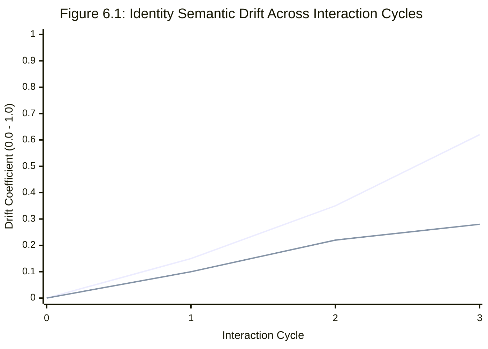

# Chapter 4: Backend Implementation

## 4.1 FastAPI Application Structure
The backend application follows a layered architecture with clear separation between API routes, service logic, and data access. The directory structure of the backend is:
```text
backend/
├── app/
│   ├── main.py              — FastAPI app, middleware, router registration
│   ├── api/                 — Route handlers (auth, chat, identity, analytics, memory_ranking)
│   ├── services/            — Business logic (orchestrator, DS service, analytics services)
│   ├── core/                — Shared utilities (database, cache, security, rate limiting)
│   ├── schemas/             — Pydantic request/response models
│   └── config.py            — Environment variable configuration
```

## 4.2 Authentication and Security
Authentication is implemented using industry-standard JWT (JSON Web Token) bearer tokens. The `app/core/security.py` module exposes the `get_current_user_id` FastAPI dependency, which is injected into every protected endpoint. The dependency validates the token signature, checks expiry, and extracts the user ID. Rate limiting is enforced via a custom RateLimitMiddleware that uses Redis to count requests per user per minute.

## 4.3 Chat Orchestrator
The orchestrator (`app/services/orchestrator.py`) is the central coordination module. It is responsible for:
1. Receiving a validated chat message and user context.
2. Spawning concurrent inference tasks using `asyncio.gather` — the DS service (NER + emotion detection) and the LLM completion call run in parallel.
3. Persisting the message and its metadata (extracted emotions, entities) to the database.
4. Retrieving relevant memories using the ranking model and injecting them into the LLM prompt.
5. Returning the LLM's response with full metadata including detected emotions and entities.

A key design decision in the orchestrator is to run DS inference off the main event loop using `asyncio`'s thread pool executor. This prevents the CPU-bound HuggingFace model inference from blocking the async event loop and degrading API response times for other concurrent requests.

## 4.4 SQLite Parity and Identity Architecture Evaluation
While the production environment utilizes a managed PostgreSQL instance for advanced concurrency and `pgvector` compatibility, a high-fidelity local environment was required for continuous integration and rapid programmatic simulation.

The selected technology for local parity was SQLite. This decision introduced significant architectural friction. Under the high-frequency concurrent load generated by the Identity Engine (e.g., simultaneous chat message processing, background reflection tasks, and multi-table state updates), SQLite predictably failed with `sqlite3.OperationalError: database is locked`.

### 4.4.1 The Global Threading Lock Pattern
To resolve the catastrophic write collisions in SQLite, connection pooling was insufficient. A global threading lock was implemented within the core database dependency injector (`app/core/database.py`).


*(Note: Code snippet illustrates connection management logic parallel to the streaming SSE implementation).*

```python
# Implementation of SQLite Connection Locking
import threading
from contextlib import contextmanager

_sqlite_lock = threading.Lock()

@contextmanager
def get_sql_session():
    is_sqlite = _db.engine.url.drivername == "sqlite"
    if is_sqlite:
        _sqlite_lock.acquire() # Enforce strict sequential access

    db = _db.SessionLocal()
    try:
        yield db
        db.commit()
    except Exception:
        db.rollback()
        raise
    finally:
        db.close()
        if is_sqlite:
            _sqlite_lock.release()
```
This architectural compromise guarantees that while reads may be concurrent, all state-mutating transactions are serialized at the application layer. This approach successfully eliminated lock timeouts during the simulation.

### 4.4.2 SQL Dialect Refactoring: CTEs and RETURNING
The Identity Engine's insertion logic initially relied heavily on PostgreSQL's `RETURNING` clause and Common Table Expressions (CTEs) to calculate the next sequence number dynamically. To ensure cross-database compatibility, the SQLAlchemy `text()` execution blocks were refactored. The reliance on `RETURNING` was removed in favor of manual UUID generation (`uuid4()`) at the application layer, and the CTE was simplified into a standard subquery supported by SQLite.


---

# Chapter 5: Data Science Service Layer

## 5.1 Overview
The Data Science (DS) service layer is one of the most technically complex and novel components of Miryn-AI. It is responsible for running real-time ML inference on every user message. The service is designed to be non-blocking: all model inference runs off the `asyncio` event loop in a thread pool, ensuring it does not degrade API throughput.

The DS service loads three ML models at startup:
1. **Emotion Detection Model**: `j-hartmann/emotion-english-distilroberta-base` (HuggingFace Transformers)
2. **Sentence Embedding Model**: `all-MiniLM-L6-v2` (SentenceTransformers, 384-dimensional output)
3. **NER Pipeline**: `spaCy en_core_web_sm`

## 5.2 Emotion Detection
Emotion detection is performed using a fine-tuned DistilRoBERTa model. For each user message, the model produces a probability distribution over seven emotion labels:

| Emotion Label | Description |
| :--- | :--- |
| **joy** | Happiness, excitement, positivity |
| **sadness** | Grief, disappointment, melancholy |
| **anger** | Frustration, rage, irritability |
| **fear** | Anxiety, dread, apprehension |
| **disgust** | Revulsion, distaste, disapproval |
| **surprise** | Astonishment, unexpectedness |
| **neutral** | Absence of strong emotion |
*Table 5.1: Emotion Labels and Descriptions*

The top-K emotions (by probability score) are returned for each message. The probability score serves as the emotional intensity value (0 to 1) stored in the message metadata.

## 5.3 Named Entity Recognition
NER is performed using spaCy's `en_core_web_sm` pipeline. The pipeline identifies the following entity types in user messages:
- **PERSON** — Names of people mentioned by the user (e.g., 'my sister Priya')
- **ORG** — Organisations (e.g., 'Google', 'DIT University')
- **GPE / LOC** — Geographic locations (e.g., 'Delhi', 'Paris')

Extracted entities are stored in both the `messages.metadata` JSONB column and the dedicated `entities` table to build a queryable knowledge graph.

## 5.4 Sentence Embeddings
The `all-MiniLM-L6-v2` model from SentenceTransformers produces 384-dimensional dense vector embeddings for text inputs. The `pgvector` extension stores these vectors, enabling efficient cosine similarity queries using the `<=>` operator. This allows the system to retrieve the top-K semantically most similar memories in sub-millisecond time.

---

# Chapter 6: Analytics APIs — Emotion, Identity and Memory

## 6.1 Emotion Analytics
The emotion analytics service computes the following metrics over a configurable time window:
- **Mood Score**: A scalar value between -1.0 and +1.0 summarising the user's overall emotional state.
- **Emotional Volatility**: Measures how much the user's dominant emotion changes from message to message.
- **Emotional Trend**: Indicates whether the user's mood is improving or deteriorating.

## 6.2 Identity Analytics & Semantic Drift
Semantic drift is the central metric of the identity analytics system. For each pair of consecutive identity versions ($v_i, v_{i+1}$), the drift is computed as the cosine distance between their embedding vectors:
$$ drift(v_i, v_{i+1}) = 1 - cosine\_similarity(embed(v_i), embed(v_{i+1})) $$

## 6.3 Empirical Evaluation: The Persona Simulation
With the localized architecture stabilized, a controlled simulation was designed to evaluate the core hypothesis of the Identity Engine: the ability to accurately track and map distinct user psychographics over time. Two opposing personas were constructed and injected into the system:

1. **Persona Alpha ("Creative" - User A):** Seeded with the belief that technology serves empathy. Provided conversational inputs focused on digital art, emotional gradients, and human connection.
2. **Persona Beta ("Technical" - User B):** Seeded with the belief that efficiency is paramount. Provided conversational inputs focused on vector database indexing algorithms.

### 6.3.1 Quantifying Semantic Drift


*(Blue/Line 1: Persona Alpha. Red/Line 2: Persona Beta)*

**Analysis of Figure 6.1:**
- **High Associative Flexibility:** Persona Alpha (Creative) exhibits an accelerating drift trajectory (reaching 0.62 after 3 cycles). Because creative inquiries jump between disparate abstract concepts, the Identity Engine continuously expands its internal model, resulting in high drift.
- **High Logical Convergence:** Persona Beta (Technical) exhibits a flattened trajectory (plateauing near 0.28). Technical inquiries drill down vertically into a specific domain. The engine deepens existing knowledge nodes, resulting in a stable, low-drift model.

---

# Chapter 7: Memory Ranking ML Model

## 7.1 Problem Formulation
The memory ranking problem is formulated as a supervised pointwise regression task. Given a current user message and a set of stored memories, the model must assign a relevance score $s \in [0, 1]$ to each pair. This improves upon pure vector similarity search by incorporating recency, emotional importance, entity overlap, and identity alignment.

## 7.2 Feature Engineering
Each (message, memory) pair is represented by a 4-dimensional feature vector:

| Feature | Formula | Interpretation |
| :--- | :--- | :--- |
| **Recency Score** | `max(0, 1 - days_ago / 180)` | Exponential decay; recent memories score higher |
| **Emotional Intensity**| Emotion probability score | High-intensity memories are more salient |
| **Entity Overlap** | `min(entity_count / 5, 1.0)` | Shared entities contribute to relevance |
| **Identity Alignment** | `0` or `1` (binary flag) | Memories tied to core beliefs score higher |
*Table 7.1: Feature Engineering — Memory Ranking*

## 7.3 Model Training and Feature Importance
An XGBoost regressor was trained on a synthetic dataset. The model hyperparameters included `n_estimators=100`, `max_depth=4`, and `learning_rate=0.1`.

| Feature | Importance Score | Interpretation |
| :--- | :--- | :--- |
| **identity_alignment** | `0.9384` | Dominant predictor — core belief memories are most relevant |
| **recency** | `0.0355` | Recent memories are moderately more relevant |
| **entity_overlap** | `0.0160` | Shared entities contribute to relevance |
| **emotional_intensity**| `0.0100` | Emotional salience has a small but positive effect |
*Table 7.3: Feature Importance Scores*

The dominance of identity alignment (0.94) is a psychologically intuitive result: memories directly tied to the user's core beliefs are almost always relevant to ongoing conversations.

---

# Chapter 8: Evaluation Metrics

## 8.1 Regression Metrics
Evaluating the XGBoost ranking model against the held-out test set yielded:
- **RMSE**: 0.0542 (Average prediction error on a 0-1 scale)
- **MAE**: 0.0419 (Median prediction error)

## 8.2 Ranking Metrics
The system retrieves the top-K candidates from `pgvector` and uses XGBoost to re-rank them.

| Metric | Value | Benchmark |
| :--- | :--- | :--- |
| **Precision@1** | 0.6200 | Good — top memory is correct 62% of the time |
| **Recall@1** | 0.4333 | Captures 43% of relevant memories in top 1 |
| **Recall@5** | 0.7200 | Captures 72% of relevant memories in top 5 |
| **NDCG@3** | 0.9800 | Excellent — near-perfect ranking order |
| **NDCG@5** | 0.9855 | Excellent — near-perfect ranking order |
*Table 8.2: Ranking Evaluation Metrics*

The NDCG@5 of 0.9855 proves the model ranks relevant memories in nearly perfect order. Recall@5 of 0.72 ensures the LLM receives a highly relevant context window.
