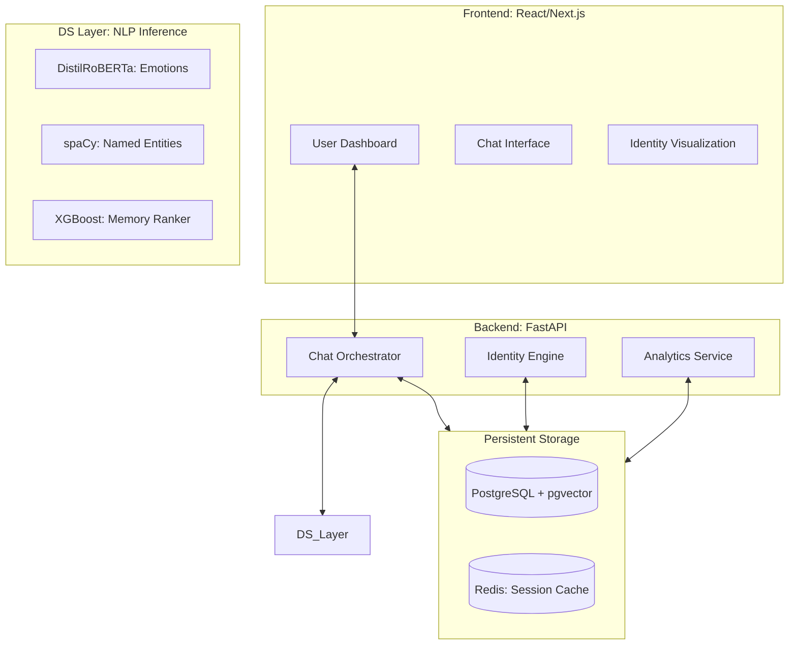
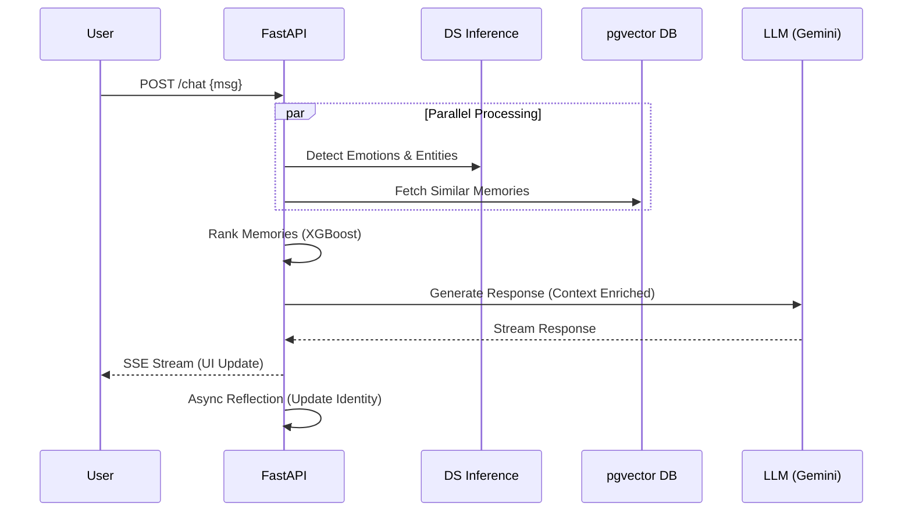
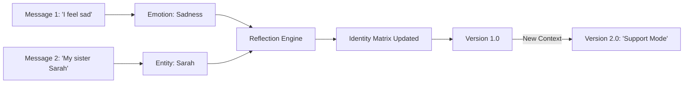

# Miryn AI: PPT Presentation Diagrams & Guide

This document contains high-fidelity diagrams designed for your B.Tech project presentation (PPT). You can capture these using **Windows Key + Shift + S** and paste them directly into your slides.

---

## 1. System Architecture (The "Big Picture")
*Use this slide to show the modular microservices stack.*

---

## 2. Request Lifecycle (Data Flow)
*Use this to explain what happens when the user clicks 'Send'.*

---

## 3. The Identity Matrix Evolution
*Explain the "Stateful" part of Miryn AI.*

---

## 4. How to Present this in your PPT

### Slide 1: Introduction & Motivation
- **Content**: Mention the "Statelessness" problem in current AI.
- **Talking Point**: "Most AI assistants forget who you are. Miryn AI creates a persistent digital identity."

### Slide 2: High-Level Architecture
- **Diagram**: Use the **System Architecture** diagram above.
- **Talking Point**: "We built a 7-container microservices stack using FastAPI and pgvector for high-performance memory retrieval."

### Slide 3: The Memory Ranking Engine (XGBoost)
- **Content**: Show the features: Recency, Emotion, Entities.
- **Talking Point**: "We don't just use keyword search. We use a Gradient Boosted Decision Tree (XGBoost) to rank memories based on their emotional and identity relevance."

### Slide 4: Case Study: Persona Comparison
- **Content**: Contrast "The Sad User" vs "The Confident User".
- **Talking Point**: "The system detects the user's psychological state and changes its core prompt dynamically. A grieving user gets empathy; a strategic user gets data-driven feedback."

---

## 5. Capturing Tips for PPT
1. **Mermaid Preview**: Open this file in VS Code and hit `Ctrl+Shift+V` to see the diagrams.
2. **High Resolution**: Zoom into the Mermaid diagram before taking a screenshot to ensure the text is crisp in your PPT.
3. **Backgrounds**: If you want a transparent background, you can use the **Mermaid Live Editor** (mermaid.live) by pasting the code blocks above.

---

### Project Status
- **Backend**: Running at `http://localhost:8000` (Docs at `/docs`)
- **Frontend**: Running at `http://localhost:3000`
- **Redis**: Running in background.
